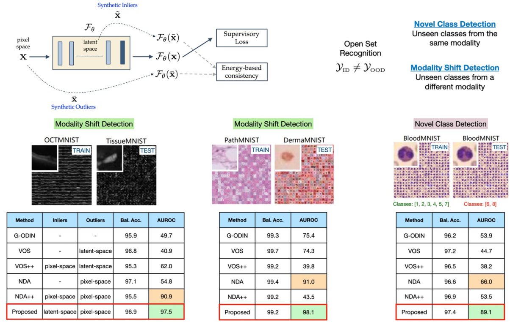

# Know Your Space: Inlier and Outlier Construction for Calibrating Medical OOD Detectors


This repository hosts the official PyTorch implementation for: [`Know Your Space: Inlier and Outlier Construction for Calibrating Medical OOD Detectors`](https://openreview.net/forum?id=RU7fr0-M8N), MIDL 2023.

## Abstract
>
We focus on the problem of producing well-calibrated out-of-distribution (OOD) detectors, in order to enable safe deployment of medical image classifiers. Motivated by the difficulty of curating suitable calibration datasets, synthetic augmentations have become highly prevalent for inlier/outlier specification. While there have been rapid advances in data augmentation techniques, this paper makes a striking finding that the space in which the inliers and outliers are synthesized, in addition to the type of augmentation, plays a critical role in calibrating OOD detectors. Using the popular energy-based OOD detection framework, we find that the optimal protocol is to synthesize latent-space inliers along with diverse pixel-space outliers. Based on empirical studies with multiple medical imaging benchmarks, we demonstrate that our approach consistently leads to superior OOD detection (15 - 35 percent improvement in AUROC) over the state-of-the-art in a variety of open-set recognition settings.


Refer to the diagram below for a quick summary of our approach


## Dependencies
This codebase was developed and tested using

+ matplotlib `3.4.3`
+ numpy `1.20.3`
+ scikit_learn `1.1.3`
+ torch `1.10.0`
+ opencv `0.6`


## Step 1. Training the classifier with Latent Space Inliers and Pixel Space Outliers  
To train the classifier on a dataset from MedMNIST (for e.g., bloodmnist)

```
python train_in_latent_out_pix.py --in_dataset bloodmnist --model_type wrn --dist --augmix --rand_conv --ckpt_name in_latent_out_pix
```

## Step 2. Perform OOD Detection

```
python ood_detection.py --in_dataset bloodmnist --model_type wrn --dir_name in_latent_out_pix
```

NOTE: For performing OOD detection, you must have the classifier trained on the given dataset stored in `./ckpts`

## To reproduce our results
[Click here](https://arizonastateu-my.sharepoint.com/:u:/g/personal/vnaray29_sundevils_asu_edu/ESSQ986FmfdPlBNtnYLVD9AB6cAZFjWVUeuD0kW28ltslQ?e=e2vj3A) to download the MedMNIST datasets, Train/Val Split CSV Files and Pre-trained checkpoints. Extract them in your working directory.

Download the checkpoints from the link provided above. Extract the .zip file as is in your working directory. Then execute the command in Step 2.


## Citation

Our paper can be cited as:

```
@inproceedings{narayanaswamy2023know,
title={Know Your Space: Inlier and Outlier Construction for Calibrating Medical {OOD} Detectors},
author={Vivek Narayanaswamy and Yamen Mubarka and Rushil Anirudh and Deepta Rajan and Andreas Spanias and Jayaraman J. Thiagarajan},
booktitle={Medical Imaging with Deep Learning},
year={2023}}
```

## Acknowledgments

We adapt the official implementation of Virtual Outlier Synthesis for implementing our baselines and algorithms: https://github.com/deeplearning-wisc/vos. We sincerely thank the authors for open-sourcing their code.

We thank the authors of ['MedMNIST v2-A large-scale lightweight benchmark for 2D and 3D biomedical image classification'](https://medmnist.com/) for providing the MedMNIST Benchmark

We thank the authors of ['Augmix'](https://github.com/google-research/augmix) and ['RandConv'](https://github.com/wildphoton/RandConv) for open-sourcing their implementations

We thank the authors of ['Robust Out-of-distribution Detection in Neural Networks'](https://github.com/jfc43/robust-ood-detection) for open sourcing their code base.

## License
This code is distributed under the terms of the MIT license. All new contributions must be made under this license. LLNL-CODE-850636 SPDX-License-Identifier: MIT
